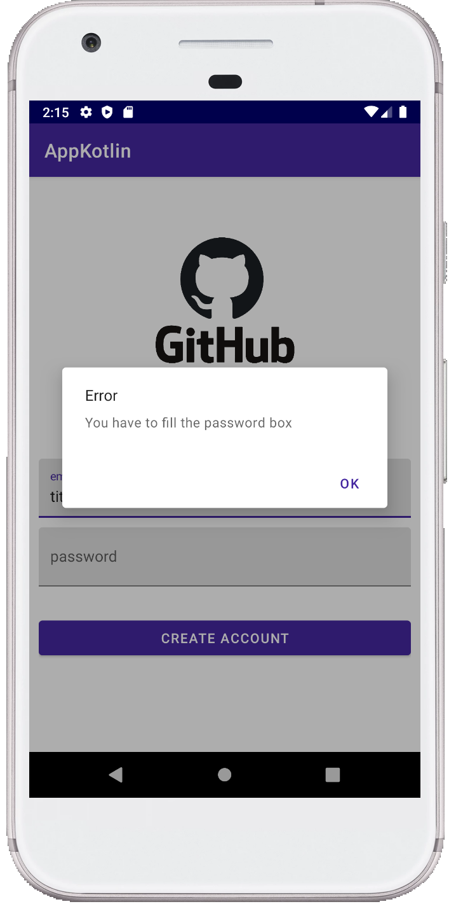
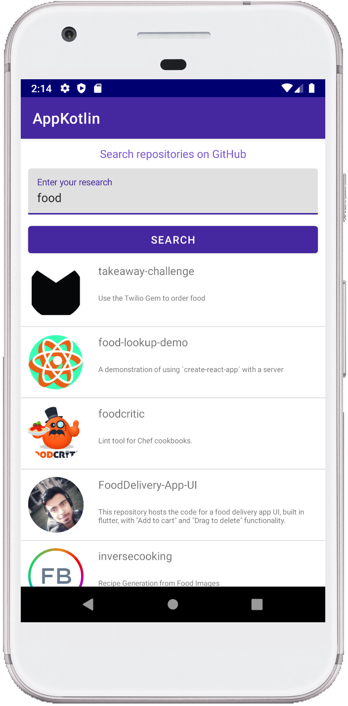
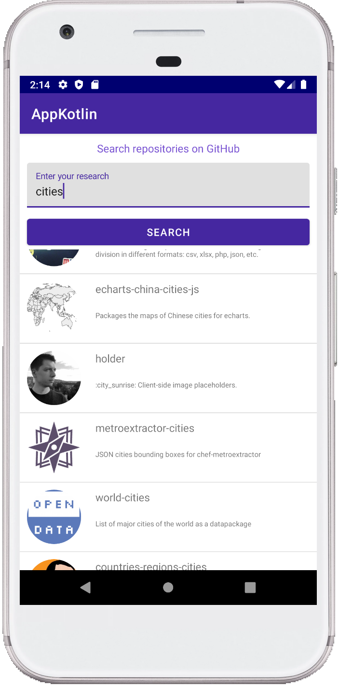

# Application Search Repositories on GitHub

## Présentation

Cette application affiche la liste des repositories GitHub filtrés par une query rentrée par l'utilisateur.
La query permet d'effectuer la recherche dans le nom, la description ou le README.

## Prérequis

* Installation d'Android Studio
* Récupération de l'api

```
https://api.github.com/search/repositories
```
## Consignes respectées

* Langage Kotlin
* Architecture MVVM
* Clean Architecture
* Utlisation d'une BDD
* Appel WebService à une API Rest
* Affichage d'une liste

## Fonctionnalités

### Premier écran

* Menu affichant l'écran de login avec le logo, possibilité de se connecter ou de se créer un compte
* Si le compte exite alors un message de confirmation s'affiche, en cliquant sur ok on est redirigé vers le troisième écran
* Si le compte n'exite pas, un message d'erreur s'affiche


  


### Deuxième écran

* Écran de création de compte
* Si le compte est correctement créé, un message de confirmation de la création du compte s'affiche et en cliquant sur ok on est redirigé vers le premier écran
* Si l'email ou le mot de passe n'est pas renseigné un message d'erreur s'affiche

  

 

### Troisième écran

* Affiche la liste des répertoires GitHub en fonction de la query rentré par l'utilisateur. Par exemple s'il l'on rentre food, on recherche alors tous les repositories avec le mot "food" dans le nom, la description ou le README.

 


